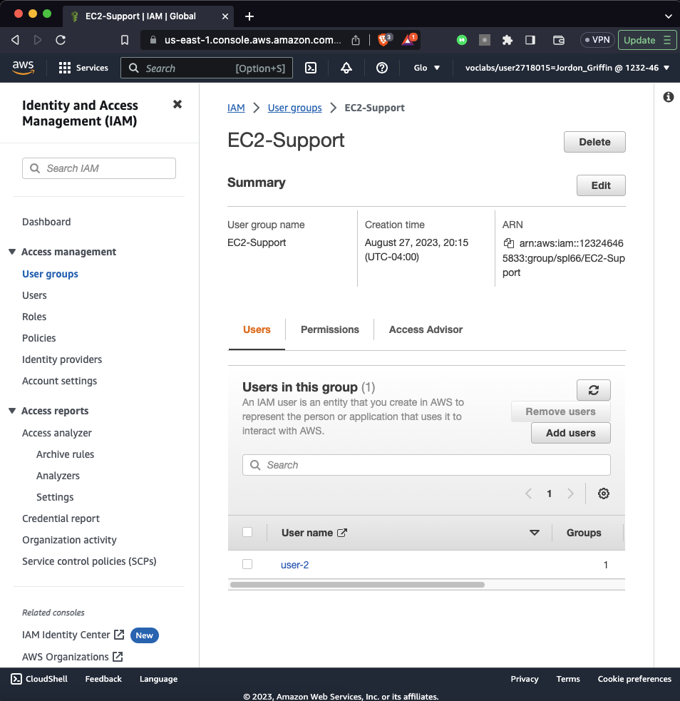
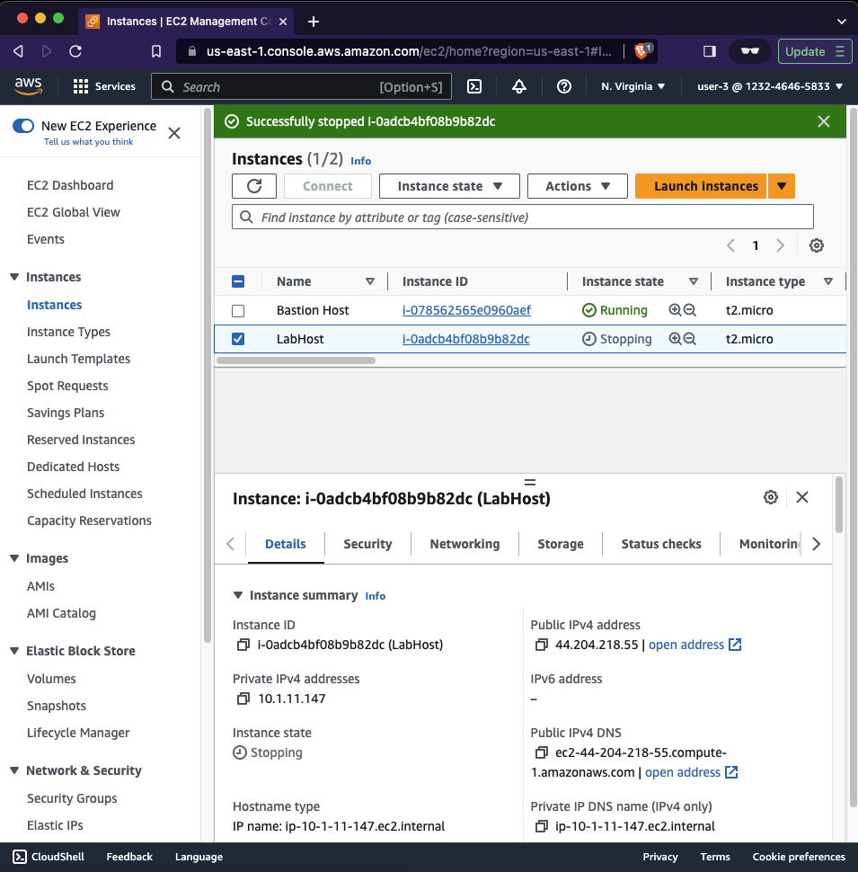

# Lab 1: Intro to AWS IAM

## A view of the permissions assigned to the EC2-Admin group

## After adding the users to the various groups, get a view of the members of the EC2-Support group.

## A view of the EC2 instances that can be access by user-3.

# Reflection
It's my understanding that IAM (Identity and Access Management) is a framework that facilitates the management of online identities and their permissions within a business. This is important because it allows for an organization to make sure that the right people access the right resources at the right times for the right reasons.

Users are the actual people doing the work within the system. Each employee would be a user, and groups are collections of users. Having groups allows for easier permissions handling.

An IAM policy is a document defining permissions. These can be assigned to individual users or groups.